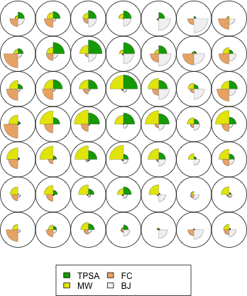
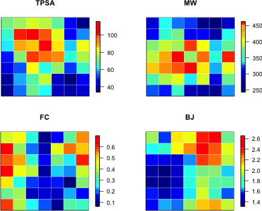
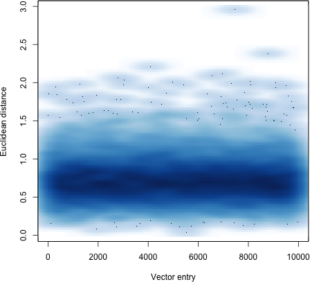
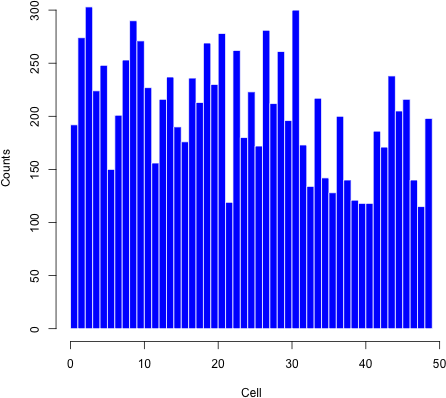
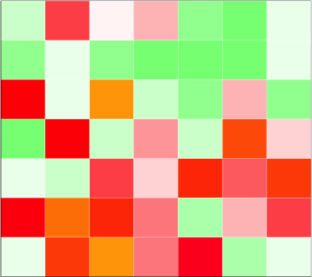

.. _1.0.1/som-it:

########
|som-it|
########

.. contents:: Table of contents
   :backlinks: none

.. admonition:: Copyright

   |copy| Copyright 2012-2013 by Silicos-it, a division of Imacosi BVBA

   Som-it is free software; you can redistribute it and/or modify
   it under the terms of the GNU Lesser General Public License as published 
   by the Free Software Foundation, either version 3 of the License, or
   (at your option) any later version.

   Som-it is distributed in the hope that it will be useful,
   but without any warranty; without even the implied warranty of
   merchantability or fitness for a particular purpose. See the
   `GNU Lesser General Public License <http://www.gnu.org/licenses/>`_
   for more details.

.. admonition:: Version

   Som-it 1.0.1

.. admonition:: Feedback
   
   Join our `Google groups community 
   <http://groups.google.com/group/silicos-it-chemoinformatics>`_
   to talk about inconsistencies, errors, raise questions or to make suggestions 
   for improvement.
   

************
Introduction
************

This section describes how to build, install and use a number of utilities to analyse self-organising maps 
that have been developed in **R**. This tutorial assumes you have installed **R** correctly and that you are 
familiar with the basic functions of **R**.

*************************
Download and installation
*************************

.. highlight:: console

Start by making a personal package library for **R** on your system::

	> cd ~
	> echo "R_LIBS=~/Rlibs" >> .Renviron
	
In this example, the personal package library is :file:`~/Rlibs`, but you might just as well
take another location.

Now, startup **R** and run the command ``.libPaths()`` at the prompt. You should see the directory 
:file:`~/Rlibs` appear in the output. Now, are will be able to load packages from your personal 
package library.

Add the location of your personal package library to your :file:`.bash_profile` file::

	> echo "export R_LIBS=\"~/Rlibs\"" >> ~/.bash_profile

Download |som-it| from our :ref:`software <software>` section and un-tar this file into the 
:file:`/usr/local/src` directory::

	> cd /usr/local/src
	> sudo tar -xvf ~/Downloads/som-it-1.0.1.tar.gz

Start up a new shell, change into the :file:`/usr/local/src` directory and start the building 
process::

	> cd som-it-1.0.1
	> sudo make
	> sudo make install
	
The process installs the :file:`som-it` executable in the :file:`/usr/local/bin/` directory, and
it will copy the :file:`som-it.R` file to the directory indicated with the :envvar:`R_LIBS` 
environment variable::

	> ls /usr/local/bin/som-it
	/usr/local/bin/som-it*
	> ls $R_LIBS/som-it.R
	~/Rlibs/som-it.R

Finally, one should specify the correct location of the :file:`som-it` executable in the
:file:`som-it.R` file. You can find this location in the 
``project.matrix.on.som()`` function within the :file:`som-it.R` file.
	
.. note::

   In the :file:`Makefile` it is assumed that the C++-compiler is :file:`/usr/bin/g++`. 
   Modify this if needed. For building under Windows, one should first install 
   `cygwin <http://cygwin.com/install.html>`_ and 
   `mingw-make <http://cs.nyu.edu/rgrimm/teaching/fa07-oop/windows-make.html>`_. 
   Using the ``cygwin`` ``g++`` C++ compiler, find the following line in :file:`Makefile`::

      CC = /usr/bin/g++

   and replace with::

      CC = g++

************
Loading in R
************

.. highlight:: r

Once installed, the utilities can be made available within **R** by starting up **R** and typing::

   > source("~/Rlibs/som-it.R")

.. highlight:: console

You can automate this step by adding the following to :file:`~/.Rprofile` file::

	> echo ".First <- function() { source(\"~/Rlibs/som-it.R\") }" >> ~/.Rprofile

.. highlight:: r

Start up **R** and check the installation::

	> ls()
	[1] "color.matrix.by.counts" "color.som.by.property"  "project.matrix.on.som" 

For the purpose of this tutorial, an example datafile :file:`tutorial-data.txt` has been included in the 
|som-it| distribution. This datatable is composed of 10,000 entries comprising the topological 
polar surface area (TPSA), the molecular weight (MW), the fraction of saturated carbons over the total 
number of carbon atoms (FC), and the Balaban-J index (BJ) generated from a random selection of 10,000 
compounds. All four properties were calculated using the **RDKit** toolkit in **Python**.

Assuming that ``som-it`` has been been installed according the procedure described above, load ``som-it.R`` 
and the :file:`tutorial-data.txt` datatable accordingly::

	> source("~/Rlibs/som-it.R")
	> ls()
	[1] "color.som.by.property"  "plot.matrix.as.heatmap"  "project.matrix.on.som" 
	> tutorial <- read.table("/usr/local/src/som-it-1.0.1/tutorial-data.txt", header = T)
	> tutorial[1,]
	   TPSA     MW     FC     BJ
	1 64.63 365.43 0.2727 1.8707
	> summary(tutorial)
	      TPSA              MW              FC               BJ        
	 Min.   : 20.31   Min.   :160.2   Min.   :0.0000   Min.   :0.9524  
	 1st Qu.: 50.68   1st Qu.:318.3   1st Qu.:0.1667   1st Qu.:1.5471  
	 Median : 66.48   Median :360.4   Median :0.2857   Median :1.7441  
	 Mean   : 66.55   Mean   :362.1   Mean   :0.3068   Mean   :1.7825  
	 3rd Qu.: 81.16   3rd Qu.:407.4   3rd Qu.:0.4286   3rd Qu.:1.9863  
	 Max.   :137.98   Max.   :499.8   Max.   :0.8182   Max.   :2.8987  

****************
Training the SOM
****************

Defining a SOM and the training of it will be performed using the Kohonen package. Load this package into 
R and define a rectangular SOM-grid of 7-by-7 cells::

	> library('kohonen')
	Loading required package: class
	Loading required package: MASS
	> grid <- somgrid(xdim = 7, ydim = 7, topo = "rectangular")

Cell points are numbered from bottom-left (1) to top-right (49), moving from left to right and 
from bottom to top.

It is advisable to scale the dataset to unit-variance and zero-mean::

	> scale.center <- mean(tutorial)
	> scale.scale <- sd(tutorial)
	> tutorial <- scale(tutorial, scale.center, scale.scale)

The last step is the training of the SOM as a toroidal map with the scaled :file:`tutorial-data.txt` 
dataset::

	> trained.som <- som(data = tutorial, grid = grid, toroidal = T)

.. note::

   You can also train a SOM starting from vector values that where derived during
   a previous run::

   > trained.som <- som(data = tutorial, grid = grid, toroidal = T)
   > trained.codes <- trained.som$codes
   > new.som <- som(data = tutorial, grid = grid, toroidal = T, init = trained.codes)

   Also, if you want to change the default of 100 training cycles,
   use the ``rlen`` option::

   > trained.som <- som(data = tutorial, grid = grid, toroidal = T, rlen = 1000)

You can inspect the quality of the resulting SOM by typing::

	> summary(trained.som)
	som map of size 7x7 with a rectangulartoroidal topology.
	Training data included; dimension is 10000 by 4
	Mean distance to the closest unit in the map: 0.6037624
	> plot(trained.som)

Plotting the SOM with the command given above yields a plot like this, showing the relative magnitudes 
of the four vector points in each of the 49 cells:

*****************
Analyzing the SOM
*****************

Color the SOM by property values
********************************

In order to visualize the resulting SOM in a way that each cell is colored according the value of a given 
property, the ``color.som.by.property()`` function was included in the ``som-it.R`` package. The usage is 
straigthforward and required only the trained som and the property to be defined::

	> color.som.by.property(trained.som, "TPSA")

You can use all function parameters that are available for drawing plots. In order to color the map 
with all four properties, use a for-loop::

	> par(mfrow=c(2,2))
	> for(i in 1:length(colnames(tutorial))) { 
	color.som.by.property(trained.som, colnames(tutorial)[i],
	xlab = "", ylab = "", main = colnames(tutorial)[i]) }

.. image:: /software/som-it/1.0.1/scaled.properties.on.som.png

In this example the legend captions are shown as the real values of the cell points; however you can 
scale the legend captions so that the values before scaling are shown::

	> par(mfrow=c(2,2))
	> for(i in 1:length(colnames(tutorial))) { 
	color.som.by.property(trained.som, colnames(tutorial)[i],
	center = scale.center[i], scale = scale.scale[i],
	xlab = "", ylab = "", main = colnames(tutorial)[i]) }

Map a matrix of data points onto the SOM
****************************************

External datasets with the same number of properties calculated for each entry can be mapped onto the 
trained SOM. For this purpose, the ``project.matrix.on.som()`` function was included in the ``som-it.R`` 
package. The usage of this function requires only to define the trained SOM and the matrix that needs 
to be mapped. In the example below, the scaled ``tutorial`` dataset will be used, although that in 
real-life situations datasets other than the training stes might be used::

	> mapped <- project.matrix.on.som(trained.som, tutorial)
	> names(mapped)
	[1] "counts"    "mappings"  "distances"

The function returns a list of three elements:

``$counts``
	Is a matrix of the same dimensions as the SOM and each entry represents the number of entries that 
	have been mapped in that particular cell. The summation of all ``$counts`` entries equals the length 
	of the input matrix.
	
``$mappings``
	Is a vector with length equal to the length of the input matrix. Each entry in the vector corresponds 
	to the SOM cell into which that particular matrix entry has been mapped.
	
``$distances``
	Is a vector with length equal to the length of the input matrix. Each entry in the vector represents 
	the distance to the SOM reference vector of corresponding SOM cell.

A scatterplot of the ``$mappings`` shows that the average distance of the entries to their corresponding 
nearest cell is around 0.73 with a standard deviation of 0.25::

	> mean(mapped$distances)
	[1] 0.7344294
	> sd(mapped$distances)
	[1] 0.2537366
	> smoothScatter(mapped$distances, xlab="Vector entry", ylab="Euclidean distance")

Plotting a histogram of the ``$mappings`` shows the cells with the corresponding number of entries 
mapped into::

	> hist(mapped$mappings, main = "", breaks=seq(0,49), col='blue', 
	xlab = "Cell", ylab="Counts", border="white")

Alternatively, you can also plot the ``$counts`` with the ``plot.matrix.as.heatmap()`` function 
as described in the next section.

Plot a matrix as heatmap
*************************

Following the mapping as described in the previous section, you can plot the result of this mapping 
using the ``plot.matrix.as.heatmap()`` function::

	> mapped$counts
	     [,1] [,2] [,3] [,4] [,5] [,6] [,7]
	[1,]  192  253  190  119  261  128  171
	[2,]  274  290  176  262  196  200  238
	[3,]  303  271  236  180  300  140  205
	[4,]  224  227  213  223  173  121  216
	[5,]  248  156  269  172  134  118  140
	[6,]  150  216  230  281  217  118  115
	[7,]  201  237  278  212  142  186  198
	> plot.matrix.as.heatmap(mapped$counts)

.. note::

	The ``plot.matrix.as.heatmap()`` function is designed to plot a heatmap of a matrix with the matrix row plotted
	along the x-axis (absis) and the matrix columns as the y-values (ordinated). Hence [r,c] -> [x,y].

****************
Revision history
****************

Version 1.0.1
*************

[released on February 24, 2013]

Adopted code to compile on Ubuntu Linux. Updated installation documentation by including
instructions for compiling on Windows.

Added <cstdlib> header file to source code

Version 1.0.1
*************

This is the first official release of |som-it|.

